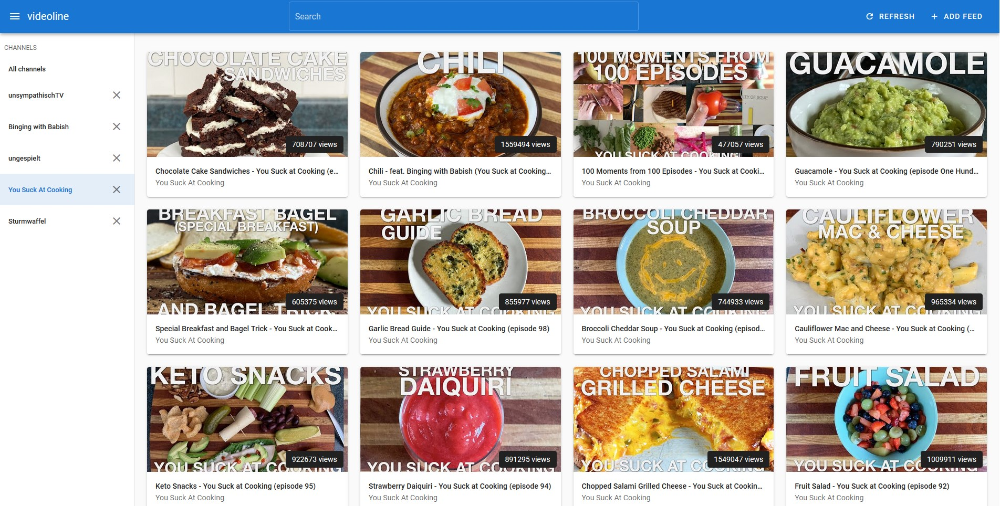

<p align="center"></p>

<p align="center"><i>A Google-free YouTube "subscription" management interface</i></p>

<p align="center"></p>

## About

videoline is a Google-free YouTube subscription management interface, which enables users to follow their favorite creators content without having to own a YouTube/Google account to subscribe and be notified about new uploads.

videoline utilizes YouTube's ancient RSS feeds and saves the video metadata to render the list of videos in a YouTube-like fashion.

In addition to being generally Google-free, the links to YouTube videos inside the feed also utilize https://www.invidio.us/ ([Project on GitHub](https://github.com/omarroth/invidious)) instead of YouTube, _which will be made configurable later to allow YouTube or custom/self-hosted invidious instances_.

The web app is made to run completely standalone without any backend service, utilizing browser technology like IndexedDB to store channel and video information. This is done so self-hosting is super easy, just build the app once and throw the assets on your server!

You can check out a demo instance at https://videoline.app!

## Setup

```
npm install
```

### Compiles and hot-reloads for development
```
npm run serve
```

### Compiles and minifies for production
```
npm run build
```

### Lints and fixes files
```
npm run lint
```

## Contributing

There are many ways to contribute and all of them are welcome!

* If you **found a bug** or have a **feature request**, [please report it](https://github.com/pixeldesu/videoline/issues/new)!
* If you want to **fix a bug** or **add a feature**, [fork](https://github.com/pixeldesu/videoline/fork) the repository and [open a Pull Request](https://github.com/pixeldesu/videoline/compare)!


## License

This project is licensed under aGPL v3!
